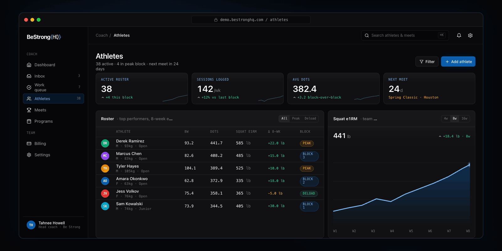

<div align="center">

# BeStrong HQ

**Coaching infrastructure for powerlifting teams.**

[](https://github.com/TennisShoeNinja/BeStrongHQ/actions/workflows/ci.yml)


<br />


<br />
[](https://github.com/sponsors/TennisShoeNinja)
</div>

<br />

From Google Sheets chaos to structured athlete progression, meet prep, and block planning, in the dashboard coaches will actually love opening. Built by a powerlifting coach, for powerlifting coaches.

<div align="center">
  
</div>

## Features

### Spreadsheet Parser
Your Google Sheets become a structured database, automatically. Every set, rep, weight, RPE, accessory movement, primary lift day, and block type (Strength, Peaking, Hypertrophy) gets tagged and indexed. Program number, date range, and theme come straight from the filename. Ready out of the box if you use a 4-day or 5-day template tested with the default parser, or your own format via a [custom parser](docs/custom-parser-guide.md).

### Athlete Management
Full athlete profiles with maxes, weight class, division, federation, contact info, and availability status. Automatic PR tracking with a timeline per lift and bodyweight history. Combine duplicate athletes with a preview so you can see exactly what's getting merged. Archive athletes you're not working with without deleting their data. Pick which columns show on your roster, filter, sort, and export to CSV. Search across athletes and exercises. **Manage exercise variations** so you don't end up with duplicates on your charts. Prescribe "Pause Deadlift" one week and "Pause Deadlift 1-0-0" the next? Tell BeStrong HQ they're the same lift and they plot as one clean line instead of getting split across two entries.

### Training Analytics
- **Estimated 1RM trends** per lift, so you can see exactly how much each block added to their number
- **Weekly volume tracking** across programs, so you can tell who responds to more volume and who doesn't
- **RPE compliance** showing how closely your athletes hit the RPEs you prescribed
- **Primary lift day tagging** so you can tell the app which day is the real squat / bench / deadlift day and the charts track the right session
- **Bodyweight trends** with latest, max, and min
- **Data quality flags** for weird weights, missing bodyweight logs, and sessions the estimator can't read cleanly

### Meet Management
Create meets with dates, federation, location, and LiftingCast links. Assign athletes and see everyone's weeks-out countdown at a glance, color-coded (red inside 4 weeks, orange inside 8, cyan beyond). One page per meet with every athlete entered and where they stand on their prep. Log what they actually hit on meet day, kept separate from their training maxes.

### Coaching Workflow
A **Work Queue** of athletes who need their next program written, driven by your program-due reminders. While you're working an athlete, a panel shows their latest block's results (estimated 1RMs per lift, any PRs hit, how it compared to the block before) alongside a one-click link to their current spreadsheet in a new tab. That way you're writing the next block with their most recent numbers and the source doc both right in front of you. Built-in session timer tracks time per athlete. 15-second undo if you mis-click. One-click buttons to set the next due date (+1 week, +1 month, custom). Inbox for reminders (programs due, meet updates). Add any athlete to the queue manually when you want to work on them outside the schedule. Rolling 30-day stats on how many athletes you've programmed and how long it took.

### Home Dashboard
Everything you need on open:
- **Quick stats:** active athletes, sessions this week, team average score (DOTS / IPF GL), next meet countdown
- **Recent PRs:** a live feed from the last 7 days
- **Upcoming meets:** next 90 days with how many athletes you have entered in each
- **Featured athlete chart:** estimated 1RM squat trend for whoever you pick
- **Weather** for the city you set, so you know what your athletes are training in

### Integrations
- **Connect Google Drive:** authenticate once with your Google account, no separate password for the app
- **Google Drive:** sync your athletes' programs straight from Drive, each athlete matched to their folder
- **Google Calendar:** push meets, program-due dates, availability, and birthdays to a dedicated team calendar

### Settings & Customization
- **Team name:** shown throughout the app
- **Coach display name:** used in your dashboard greeting
- **Weather location:** drives the weather on your home dashboard
- **Default weight unit:** pick lbs or kg, used everywhere in the app

## Community Edition

Install BeStrong HQ on your own machine. Free forever, community supported. Runs in **Docker** under the hood, with a no-cost Community Edition install path for Mac, Windows, and Linux.

**Prerequisite:** [Docker Desktop](https://www.docker.com/products/docker-desktop/) (Windows / Mac) or Docker Engine (Linux / Pi).

**Mac/Linux install:**

```bash
curl -fsSL https://bestronghq.com/install.sh | bash
bestrong open
```

**Windows early installer:** download
[BeStrongHQ-Community-Windows.zip](https://github.com/TennisShoeNinja/BeStrongHQ/releases/latest/download/BeStrongHQ-Community-Windows.zip),
extract it, then double-click `Open BeStrong.cmd`. See the
[Windows instructions](docs/install.md#windows) if Docker is not already set up.

Direct Docker commands are still available for contributors and self-hosters who
prefer them.

Open **http://127.0.0.1:3000**.

Google Drive is required for program imports, and the same Google connection can also power Calendar sync. Follow the [full install guide](docs/install.md) for the beginner-friendly Windows/Mac/Linux setup, Google OAuth walkthrough, early installer commands, and troubleshooting.

[Full install guide](docs/install.md) · [Google setup](docs/google-setup.md) · [Docker reference](docker/README.md)

<!-- Direct Docker quick start for contributors:

```bash
git clone https://github.com/TennisShoeNinja/BeStrongHQ.git
cd BeStrongHQ/docker
docker compose up -d
```
-->

## How It Works

1. **Connect your Drive.** Point BeStrong HQ at the folder where your athletes' sheets live. OAuth in, done: no file uploads, no drag-and-drop.
2. **Click Sync.** BeStrong HQ parses sets, reps, RPE, accessories, primary lift days: all structured, all queryable.
3. **Review progression.** Your dashboard shows what's trending up, what's stalling, and who's ready to hit a meet PR.

## Contributors

Powerlifting coach who codes? PRs welcome - bug fixes, new parser adapters, install guides, anything. Open an issue first if it's a big change so we can align on direction. For a quick orientation to the codebase, see [Project Structure](docs/project-structure.md) and the [CLI reference](docs/cli.md).

<a href="https://github.com/TennisShoeNinja/BeStrongHQ/graphs/contributors">
  
</a>

## License

AGPL-3.0-or-later. See [LICENSE](LICENSE).

## Support

If BeStrong HQ saves you time, consider [sponsoring on GitHub](https://github.com/sponsors/TennisShoeNinja). It keeps the free version free and the parser library growing.
